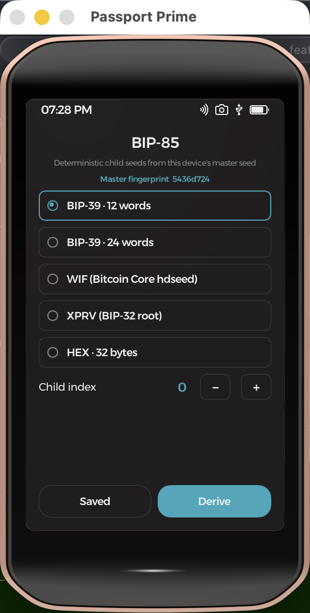
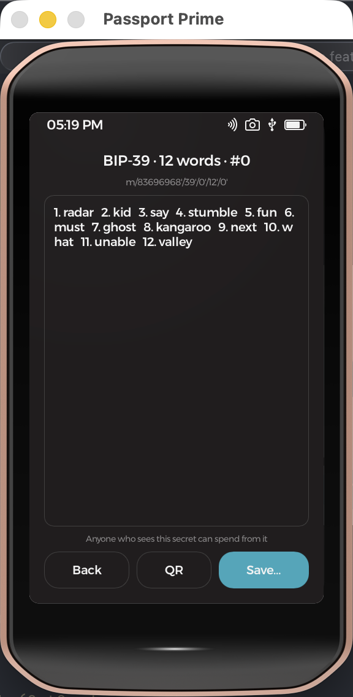
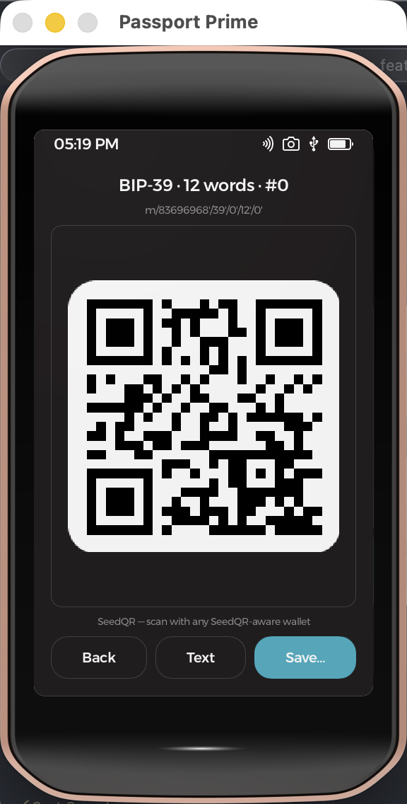
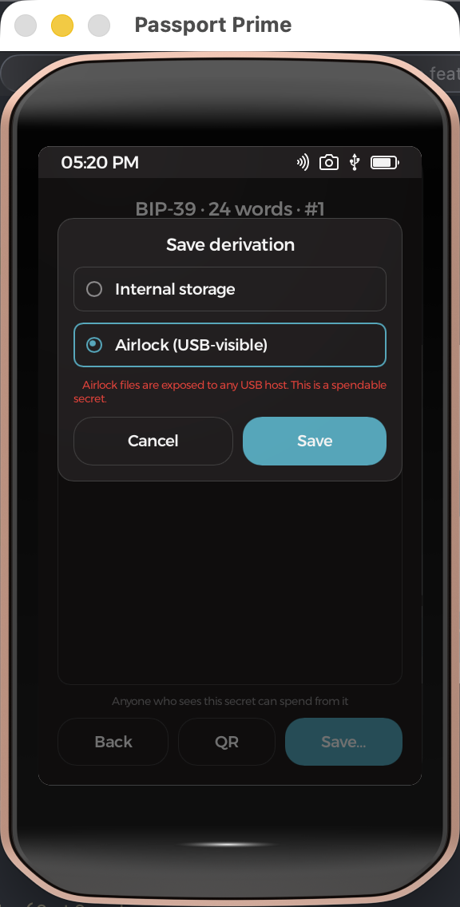
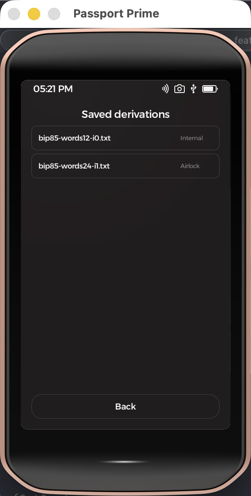

#  BIP-85 — a Passport Prime app

A **[BIP-85](https://github.com/bitcoin/bips/blob/master/bip-0085.mediawiki)
deterministic child-seed generator** for Foundation's **Passport Prime**,
built as a Rust binary with a **Slint** UI on **KeyOS** (Foundation's Rust
microkernel on Xous). It derives independent child secrets from the device's
master seed — back up one seed, recover every wallet you ever handed out.
Fully offline, like everything on Prime.

<p align="center">
  
  &nbsp;
  
  &nbsp;
  
</p>

## What it derives

| Application | BIP-85 path | Output |
|---|---|---|
| BIP-39 · 12 words | `m/83696968'/39'/0'/12'/i'` | mnemonic for another wallet |
| BIP-39 · 24 words | `m/83696968'/39'/0'/24'/i'` | mnemonic for another wallet |
| WIF | `m/83696968'/2'/i'` | Bitcoin Core `sethdseed` key |
| XPRV | `m/83696968'/32'/i'` | BIP-32 root for coordinators |
| HEX · 32 bytes | `m/83696968'/128169'/32'/i'` | raw entropy for anything else |

Reading the path: `83696968` is BIP-85's registered purpose number — the
word **SEED** as concatenated decimal ASCII (S=83, E=69, E=69, D=68), the
same convention as BIP-44's `44'`. The `'` marks hardened derivation, and
for mnemonics the middle elements are `39'` (BIP-39 application) / `0'`
(English) / word count. So `m/83696968'/39'/0'/12'/0'` reads
"BIP-85 → BIP-39 → English → 12 words → child #0".

The child index (0–99) steps with +/− buttons — no on-screen keyboard.
Mnemonics can be shown as a **SeedQR** (SeedSigner standard format) for
direct import into any SeedQR-aware wallet; WIF/XPRV/HEX render as plain
QRs of the text.

**Fingerprints**: the home screen shows the master seed's BIP-32
fingerprint (the same "xfp" Sparrow would display), and each
BIP-39/XPRV child shows *its* fingerprint on the result screen and in saved
files — for mnemonics that's the fingerprint the restored wallet will
display, so you can verify an import at a glance. WIF/HEX aren't BIP-32
nodes and have none. Fingerprint math is pinned to BIP-32's own test
vector (`3442193e`).

Derivations are **standards-compliant**: the same mnemonic in Sparrow,
`python-bip85`, or any BIP-85 wallet yields the same children. The root is the
**no-passphrase** BIP-39 root (the KeyOS `GetSeed` API exposes base entropy
only), so wallets that apply BIP-85 under an active passphrase will differ.

**Network**: derivation is network-agnostic, but WIF and XPRV are
network-*encoded* — so a Mainnet/Testnet toggle appears only when one of
those two is selected (mainnet default). Testnet outputs use the `0xEF`
WIF prefix / `tprv` version bytes, are banner-labeled TESTNET on the result
screen, and save under `-testnet` filenames. The chain choice changes only
the encodings of the same derived child.

Two options are exhaustive here: testnet3, testnet4, signet and regtest all
share the same WIF/extended-key serialization (`0xEF`/`tprv` — Bitcoin Core
gives them identical base58 prefixes), so the "Testnet" encoding works
verbatim on all of them. The networks only diverge in things this app never
emits, like bech32 address prefixes (`tb1` vs `bcrt1`).

## Saving derivations

<p align="center">
  
  &nbsp;
  
</p>

Save… writes a text file (application, path, index, secret, SeedQR digits) to:

- **Internal storage** (default) — the app's private `Location::User` space;
- **Airlock** — the USB-visible volume, behind an explicit warning: anything
  there is readable by any USB host, and these are spendable secrets.

The **Saved** browser lists both locations, opens files in a viewer, and
deletes with a two-tap confirm.

> The screenshots show children of the **all-zero test seed**
> ("abandon … art") in the simulator — publicly known vectors, never funded.

## Correctness

- `bip85-core/` is a UI-free library pinned to the official BIP-85 spec test
  vectors — raw-entropy cases, BIP-39 12/18/24 words, WIF, XPRV, HEX-64 —
  plus the canonical BIP-39 "TREZOR" vector and SeedQR digit encoding:
  `cargo test -p bip85-core` (11 tests, host-runnable).
- The simulator flow is cross-checked end-to-end: the device screen matches
  `cargo run -p bip85-core --example derive -- <entropy-hex> words12 0`
  byte for byte (`ui-automation/tests/bip85.sh` in the workspace repo).
- Secrets never appear in logs; log lines carry only application, index,
  path, and filenames.

## Build & run

```bash
foundation develop            # or prefix commands with:
                              # nix develop ~/.foundation/sdk/current --command
foundation sim                # hosted simulator
foundation build --release    # signed hardware bundle
foundation sideload           # build + install on a connected Prime
```

The hosted simulator boots with **no wallet seed** — `GetSeed` returns
`None` and the app shows "No wallet seed on this device yet". Provision
`hosted_security_data.json` first; recipe in [NOTES.md](NOTES.md), which
also covers the vendored `security`/`getrandom` crates and the `ui/ui`
symlink needed after a fresh clone.

## Permissions

Beyond the standard GUI/filesystem templates, the app requests:

- `"os/security" = ["GetSeed"]` — the master seed entropy that BIP-85
  derivation is rooted in. PIN-gated and kernel-attested on hardware.
- `"os/fs" = ["MountAirlock", "FormatAirlock"]` — the lazy Airlock
  mount/format-recovery needed by the hosted simulator's export path.
